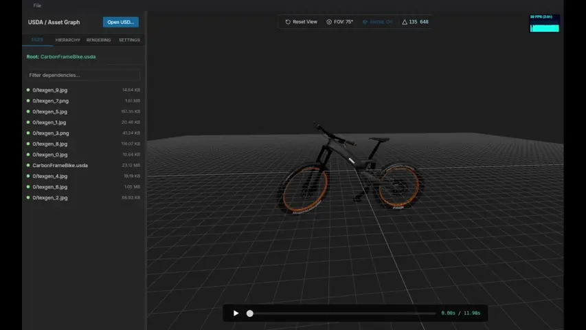

#  USDBEE

<p align="center">
  
</p>

> Lightweight (<10 MB) USD viewer built with Rust, Tauri, Svelte, and Three.js.

[](https://www.rust-lang.org/)
[](https://tauri.app/)
[](https://svelte.dev/)
[](https://threejs.org/)
[](https://opensource.org/licenses/MIT)
[](https://github.com/ThomasByr)

1. [Installation](#installation)
2. [Usage](#usage)
3. [Limitations](#limitations)

## Installation

### Pre-built binaries

> [!NOTE]
> You can download the latest release of USDBEE for your system from the [Releases](https://github.com/ThomasByr/usdbee/releases) page.

Please download the appropriate installer for your operating system, run the installer, and follow the installation instructions.

On MacOS, both Intel and Apple Silicon architectures are supported.

### Building from source

To build USDBEE from source, make sure you have [Node.js](https://nodejs.org/) (with npm - [fnm](https://github.com/Schniz/fnm) is recommended), [Rust](https://www.rust-lang.org/tools/install) and [Tauri prerequisites](https://tauri.app/start/prerequisites/) installed.

<details><summary>All-in-one setup script (Debian-based Linux)</summary>

```bash
# tauri prerequisites
sudo apt update
sudo apt install libwebkit2gtk-4.1-dev \
  build-essential \
  curl \
  wget \
  file \
  libxdo-dev \
  libssl-dev \
  libayatana-appindicator3-dev \
  librsvg2-dev
# rustup
curl --proto '=https' --tlsv1.2 https://sh.rustup.rs -sSf | sh
source $HOME/.cargo/env
# nodejs + npm (using fnm)
cargo install fnm --locked
eval "$(fnm env)"
fnm install --lts
fnm use --lts
```

</details>

<details><summary>(Not so) all-in-one setup script (Windows - PowerShell)</summary>

```powershell
# Install rustup
Invoke-WebRequest -Uri https://win.rustup.rs/x86_64 -OutFile rustup-init.exe
Start-Process -FilePath .\rustup-init.exe -ArgumentList "-y" -NoNewWindow -Wait
Remove-Item .\rustup-init.exe
$env:Path += ";$env:USERPROFILE\.cargo\bin"
# Install fnm (Node.js version manager)
cargo install fnm --locked
$env:Path += ";$env:USERPROFILE\.cargo\bin"
fnm install --lts
fnm use --lts
```

</details>

Then, clone the repository and run the following commands in the project directory:

```bash
npm install
npm run tauri build
```

This will create the application binaries in the `src-tauri/target/release` directory. Installers are also generated in the `src-tauri/target/release/bundle` directory.

Run the application with:

```bash
./src-tauri/target/release/usdbee
```

or

```ps1
& ./src-tauri/target/release/usdbee.exe
```

You can also run the application in development mode with:

```bash
npm run tauri dev
```

## Usage

Run the application and use <kbd><kbd>Ctrl</kbd>+<kbd>O</kbd></kbd> to load a USD file.

Navigate the 3D view with your keyboard and mouse. Check the "SETTINGS" tab to customize the controls.

## Limitations

[Three.js USD Composer](https://threejs.org/docs/index.html?q=USD#USDComposer) is used as the primary USD parser and renderer. It supports a subset of USD features, and some complex USD files may not render correctly, throw errors, or fail to load. The application is primarily intended for simple USD files (.usdz, .usd, .usda) containing basic geometry and materials.

Patches are implemented on a best-effort basis in [usdUtils.ts](src/lib/three/usdUtils.ts).

### Note on Tauri Asset Sandboxing

USDZ files are unpacked at runtime into the operating system's native temporary directories. To allow the Three.js `fetch` / `USDLoader` to physically read these extracted geometries, the Tauri `asset://` protocol requires explicit permission scopes.

If you are modifying where files are cached (e.g., in `src-tauri/src/fetcher.rs`), ensure the target directory is whitelisted via `$TEMP/**` or `$LOCAL_DATA/**` in the `assetProtocol.scope` inside `tauri.conf.json` to prevent silent `403 Forbidden` fetches and empty 3D scenes.

Read more:
[Tauri Asset Protocol Scopes](https://v2.tauri.app/security/scope/),
[Tauri Asset Protocol Configuration](https://v2.tauri.app/reference/config/#assetprotocol),
[Tauri Path Variables](https://v2.tauri.app/plugin/file-system/#security)
